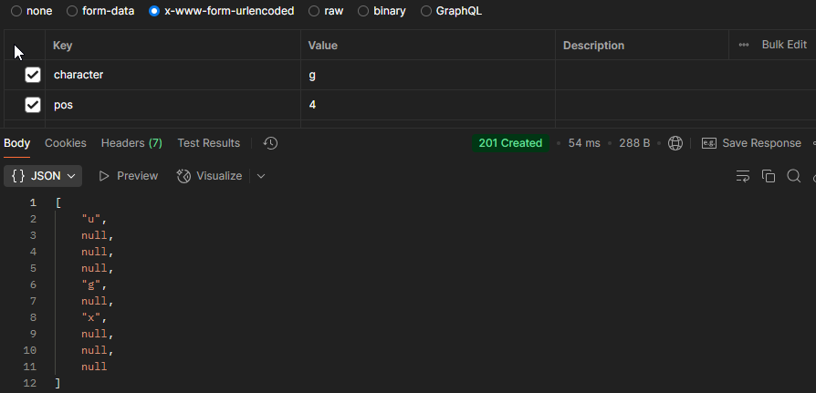

<h1 align="center">Lineal TicTacToe</h1>

 Logo e imagen o gif de la interfaz principal de la herramienta

 

## Tabla de contenidos:
---

- [Descripción y contexto](#descripción-y-contexto)
- [Guía de usuario](#guía-de-usuario)
- [Guía de instalación](#guía-de-instalación)
- [Autor/es](#autores)

## Descripción y contexto
---
Es un juego em de tictactoe de forma lineal. Si logras consegir que en 3 campos seguidos tengan tu mismo caracter ganaras la partida, si completas los 10 campos y no hay coincidencias se considera un empate y se reinicia el juego

## Guía de usuario
---
Para poder jugar debes correr la aplicacion y pasar la ruta por el postman, en el debes incluir un caracter y un numero del 0 al 9 para ubicar tu caracter en esa posicion.

 	
## Guía de instalación
---
Para poder correr la aplicacion debes clonar el codigo, entrar e instalar las dependencias. Debes instalar tambien el postman para interactuar con la aplicacion. Una vez tengas las aplicaciones instaladas debes abrir el postman, y llamar la ruta en una peticion POST con la ruta. En la seccion de body, vas donde dice x-www-urlencoded y colocas en el primer campo "character" y en el segundo campo "pos" y le asignas los valores que quieras dentro de los parametros y finalmente le das en SEND para ejecutar la aplicacion

### Dependencias

    @types/express: ^5.0.0,
    eslint: ^9.21.0,
    express: ^4.21.2,
    ts-node-dev: ^2.0.0,
    typescript: ^5.7.3

## Autor/es
---
Laura Manuela Esmoris

